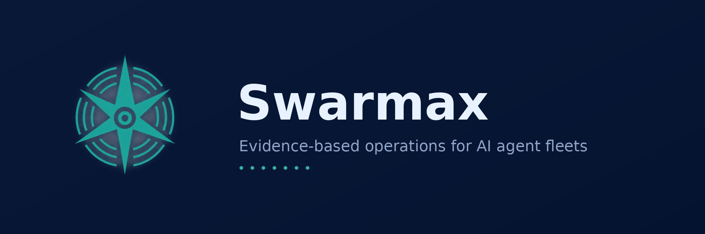

<div align="center">


# Swarmax

**Evidence-based operations for AI agent fleets.**

Sealed audit trails, SLA-alarmed triage and AI-Act-ready privacy —
in one zero-dependency Python service.

`assets/banner-v2.png` · logo set in [`assets/`](assets/)



</div>

---

Most agent frameworks show you a trace view. Swarmax is the layer that sits
behind the framework and answers the questions that matter in production:
*is this fleet actually working, what did it cost, and can you prove any of it
in an audit?*

Three things it does that we haven't found anywhere else:

- **Sealed evidence, not logs.** Every task event lands in an append-only
  ledger. Periodically the ledger is sealed with Ed25519 signatures and a
  Merkle root — tampering breaks verification, and each seal can be
  counter-signed by an independent RFC 3161 timestamp authority. When a
  customer, an auditor or a regulator asks *"what did your agents do in
  March?"*, you hand over a chain that verifies offline.
- **Alarms with a deadline.** Detection thresholds feed an escalation map
  where every alarm class carries an SLA — a runaway tool loop is Emergency
  with a 30-minute clock; an unseen error signature is Critical with 24
  hours. Open alarms count down in the console and self-escalate when the
  clock expires. Alert fatigue is a measured, budgeted quantity
  (false-positive budget ≤ 5 % of evaluation cycles).
- **Compliance as a command.** The EU AI Act asks providers for logging,
  traceability and deletion guarantees. Swarmax ships a working privacy
  toolkit (RFC 8439 crypto-shredding, Article 17 `/forget` endpoint,
  S3-compatible signed cold archive) and a compliance drill an auditor can
  run themselves: `make compliance-drill`.

Everything is Python ≥ 3.10 stdlib — **zero runtime dependencies** — so the
whole thing fits on a small VPS next to your agents, or scales to tens of
millions of events on ClickHouse. Every crypto and ingest path is pinned to
its RFC with published test vectors.

## Quickstart

```bash
pip install swarmax            # or: pip install -e .
swarmax-init                   # create a store with schema v9
python demo.py                 # synthetic fleet: 8/8 alarm classes + FP budget
make seed && make console      # realistic demo fleet -> http://127.0.0.1:8080
```

Demo console logins (created by the seeder — rotate immediately in
production): `root` / `swarmax-demo-admin`, `viewer` / `swarmax-demo-viewer`.

### Integrate in five minutes

```python
from swarmax import SwarmaxClient
client = SwarmaxClient("http://127.0.0.1:4318", "my-key", b"my-secret")
client.set_agent("support-bot", model="gpt-4o-mini")
with client.span():               # timed block -> real telemetry
    run_my_agent_step()
client.guard("web_search", fn, q) # tool call + runaway-loop protection
client.flush()
```

Full walkthrough: [`examples/quickstart.py`](examples/quickstart.py).
Node/Bun: [`examples/js/swarmax.js`](examples/js/swarmax.js) (zero-dependency
mini SDK with the same three call styles). Already tracing with Langfuse?
Mirror your fleet without touching your app:
`python -m swarmax.bridges.langfuse_pull --help`. Any OpenTelemetry-exporting
framework (LangChain, CrewAI, AutoGen, OpenLLMetry…): run the signing relay
and point `OTEL_EXPORTER_OTLP_ENDPOINT` at it — `swarmax-otel-relay --help`.

Development:

```bash
python -m pytest tests -q      # 155 tests: RFC vectors, alarm injection, sealing, perf
python scripts/smoke_e2e.py    # end-to-end: ingest -> alarms -> seal -> console
```

## What's inside

| Module | What it does |
|---|---|
| `pipeline.py` | ingest → rolling windows → per-agent facts → APD alarms |
| `otlp.py` | OTLP/HTTP+JSON ingest with HMAC anti-replay (`gen_ai.*` / `swx.*` semconv) |
| `metrics/` | EWMA control cards, robust MAD z-scores, JSD tool-mix drift, Page-Hinkley, n-gram loop breaker, MAST-aligned classifier, metamorphic end-state oracle |
| `metrics/apd.py` | Alarm & Protection Dispatcher — the §4.2 escalation map, verbatim |
| `sealing.py` + `ed25519.py` | Merkle sealing, key rotation, RFC 8032 signatures (pure Python, vectors-tested) |
| `tsa.py` | RFC 3161 timestamping client — counter-signs seals against a real TSA |
| `auth.py` / `sso.py` | console auth (scrypt, sessions, CSRF, lockout) + OIDC SSO with PKCE |
| `ch.py` | ClickHouse ReplacingMergeTree mirror — 10 M events, per-agent queries < 200 ms |
| `coldstore.py` | AWS SigV4 archive to any S3-compatible store + offline chain verify |
| `privacy/` | ChaCha20-Poly1305 crypto-shredding, HKDF, `/forget` (RFC 8439 / 5869) |
| `console.py` | multi-tenant web console: SLA queue, agent drill-down, PNG chart export, weekly report download/e-mail |
| `dogfood.py` | fleet SDK (`FleetSdk`) + `SwarmaxClient` facade (task / span / guard) |
| `bridges/langfuse_pull.py` | Langfuse → Swarmax pull bridge: maps GENERATION observations to signed `gen_ai.*` spans (idempotent) |
| `bridges/otel_relay.py` | signing relay: any framework's unsigned OTLP/HTTP → signed Swarmax ingest (fail-closed 503) |

## Acceptance gates (all enforced in CI or by drills)

| Gate | Where |
|---|---|
| 100K events, p99 ingest < 2 s (512-span batches) | `tests/test_performance.py` |
| 8/8 alarm classes detected, correct severity + SLA | `tests/test_scenarios.py` |
| False positives ≤ 5 % of hourly cycles | `test_scenarios.py::test_baseline_produces_zero_false_positives` |
| Tamper → seal verification fails | `tests/test_sealing.py` |
| Ed25519 against RFC 8032 vectors | `tests/test_ed25519.py` |
| ChaCha20-Poly1305 against RFC 8439 (cross-checked with OpenSSL) | `tests/test_privacy_crypto.py` |
| OTLP replay rejected | `tests/test_otlp.py` |
| 10M events on real ClickHouse, worst per-agent query 78 ms | `make scale-gate-ch` |
| Exit drill: export → rebuild → verify | `make drill` |
| TSA counter-signature verifies with `openssl ts -verify` | `make trust-drill` |

## Operations

```bash
make otlp          # ingest service :4318  (set SWX_INGEST_SECRET)
make console       # fleet console :8080
make seal          # seal the evidence ledger now
make drill         # quarterly exit drill (exit 0 = PASS)
make ch-mirror     # one-shot ClickHouse mirror pass
make cold-archive / cold-verify
make trust-drill   # RFC 3161 counter-signed sealing drill (live TSA)
make compliance-drill  # executable auditor walkthrough
```

The alarm map (`metrics/apd.py`): loop ≥ 2 → Emergency/30m · deny > 20 % →
Critical/4h · daily cost > 2×EWMA ∧ Z > 2.5 → Critical/24h · unseen error
class → Critical/24h · error rate > 20 %/24h → Critical/4h · retries ≥ 3 →
High/4h · JSD > 0.40 → Medium/weekly · ticket age > 24h → Emergency/2h with
self-escalation.

## Scope and limits

Swarmax observes, alarms, proves and deletes. It does **not** run your
agents, replays tasks for you, or replace your LLM gateway. Vitals that
require raw prompts/pixels (for example per-turn hallucination scoring)
stay with the framework that produced them; Swarmax consumes their events.
Multi-node active-active and managed-cloud deployments are on the roadmap —
today the honest unit is one sealed store per fleet.

## Documents

- `SWARMAX.md` — the full paper (Turkish), single source of record
- `SWARMAX_EN.md` — English edition
- `AI_ACT_COMPLIANCE.md` — the compliance dossier the drills exercise
- `DOGFOOD_PLAN.md` — the MT-1…MT-8 measurement protocol
- `CHANGELOG.md` · `CONTRIBUTING.md` · `SECURITY.md`

## License

Apache-2.0. Free to self-host, fork and run — the operation of it is what
we sell. See `docs/` in the repository for the commercial model.

<div align="center">

&nbsp;<sub>Seven points, one chain — measure everything, seal what matters.</sub>
</div>
